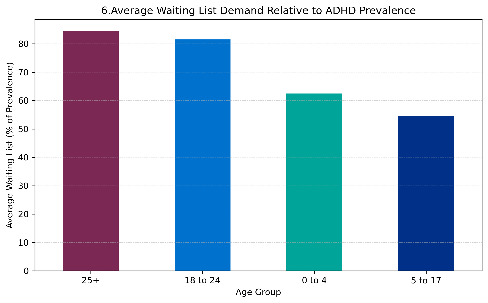

# Estimating Potential Unmet ADHD Assessment Demand in England

### Capstone Project

### Professional Certificate in Data Analytics

### Imperial College London

**Author:** Fernanda Pedley (she/her)
**Date:** June 2026

---

## Overview

This capstone project explores ADHD prevalence, referrals and waiting-list activity in England using data published by NHS England.

The aim is to investigate whether trends in prevalence, referrals and waiting-list activity can provide useful insight into potential unmet demand for ADHD assessment and treatment services.

Using Python, I analysed national ADHD data published through NHS England's Neurodevelopmental Data Hub between December 2024 and December 2025. The analysis focuses on trends over time, differences between age groups and the relationship between prevalence and waiting-list activity.

---

## Key Findings

* ADHD prevalence increased by approximately 54% between December 2024 and December 2025.
* Waiting-list activity increased by approximately 54% during the same period.
* Adult age groups accounted for most of the observed growth.
* Adult ADHD services consistently showed higher levels of service pressure than children's services.
* Potential unmet demand appears greatest within adult ADHD pathways.

---

## Key Visual

*Adult age groups showed substantially higher waiting-list demand relative to recorded ADHD prevalence than younger age groups. This suggests that service pressure may be concentrated within adult ADHD pathways.*

---

## Project Resources

* Capstone Report (final version pending)
* Jupyter Notebook
* NHS England Neurodevelopmental Data Hub

---

## Project Background

The project was completed as part of the Professional Certificate in Data Analytics at Imperial College London.

The analysis combines my interest in healthcare commissioning, service improvement and data analytics. My interest in this topic is informed both by my professional experience working within the NHS and by my personal experience of receiving an ADHD diagnosis as an adult in the UK.

---

## Author

**Fernanda Pedley (she/her)**

Programme Lead, NHS

Professional Certificate in Data Analytics
Imperial College London
