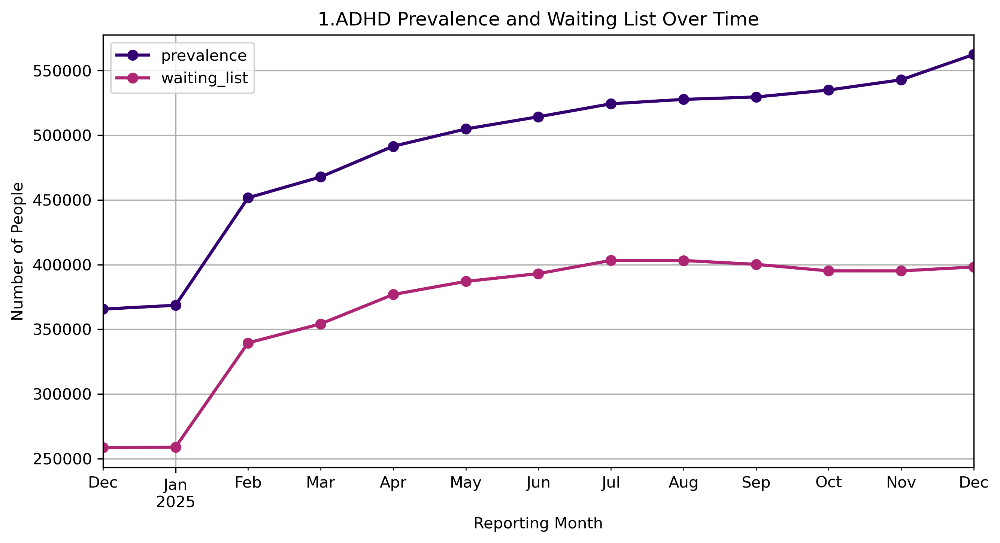
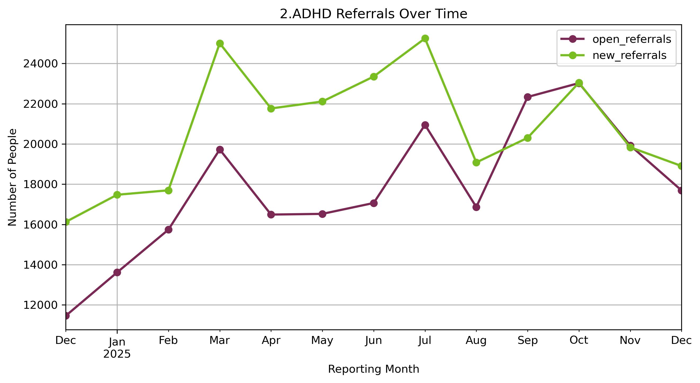
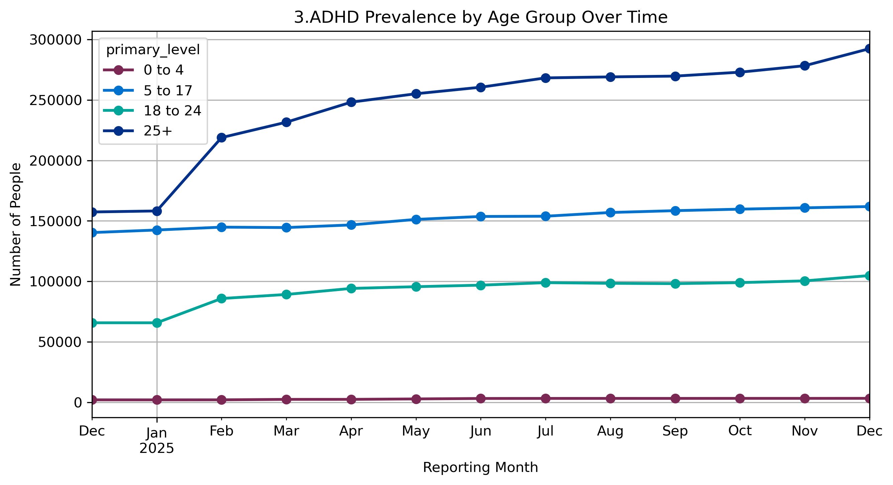
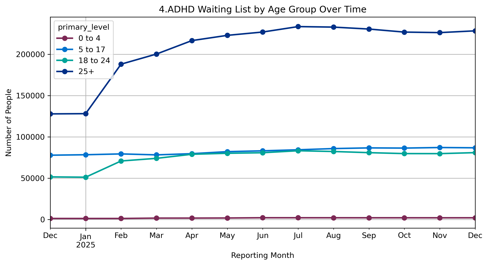
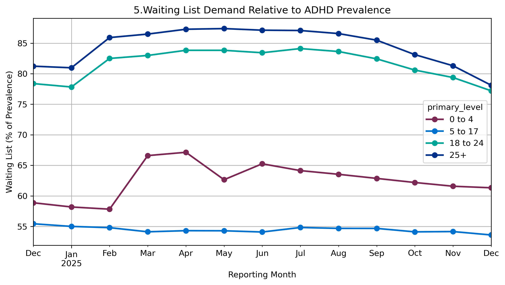
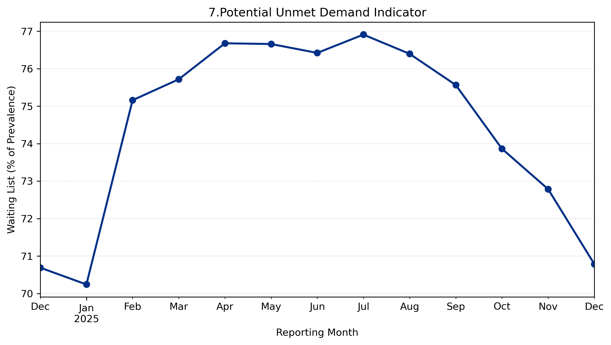

# Data Visualisations

## Navigation

* [Home](index.md)
* [Detailed Findings](findings.md)
* [Methodology](methodology.md)
* [Project Resources](resources.md)

---

## ADHD Prevalence and Waiting Lists

---

## ADHD Referrals

---

## ADHD Prevalence by Age Group

---

## ADHD Waiting Lists by Age Group

---

## Waiting List Demand Relative to ADHD Prevalence

---

## Average Waiting List Demand Relative to ADHD Prevalence

---

## Potential Unmet Demand Indicator

